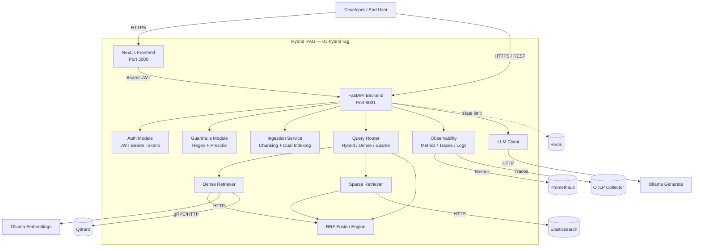

# C2 — Container Diagram: Hybrid RAG

This diagram decomposes the Hybrid RAG system into its major deployable containers and data stores.

## Container Responsibilities

| Container | Responsibility |
|-----------|----------------|
| Next.js Frontend | Browser UI for ingestion, queries, and results (scaffold). |
| FastAPI Backend | HTTP API routing, middleware, exception handling. |
| Auth Module | Issue and validate JWT access tokens. |
| Guardrails Module | Input validation and safety checks. |
| Ingestion Service | Sliding-window chunking and dual indexing into Qdrant and Elasticsearch. |
| Query Router | Orchestrates dense, sparse, and fused search endpoints. |
| Dense Retriever | Embeds text via Ollama and searches Qdrant. |
| Sparse Retriever | Searches Elasticsearch with BM25. |
| RRF Fusion Engine | Combines ranked lists using Reciprocal Rank Fusion. |
| LLM Client | Wraps Ollama `/api/generate` for future generation features. |
| Observability | Prometheus metrics, OpenTelemetry traces, structlog JSON logs. |
