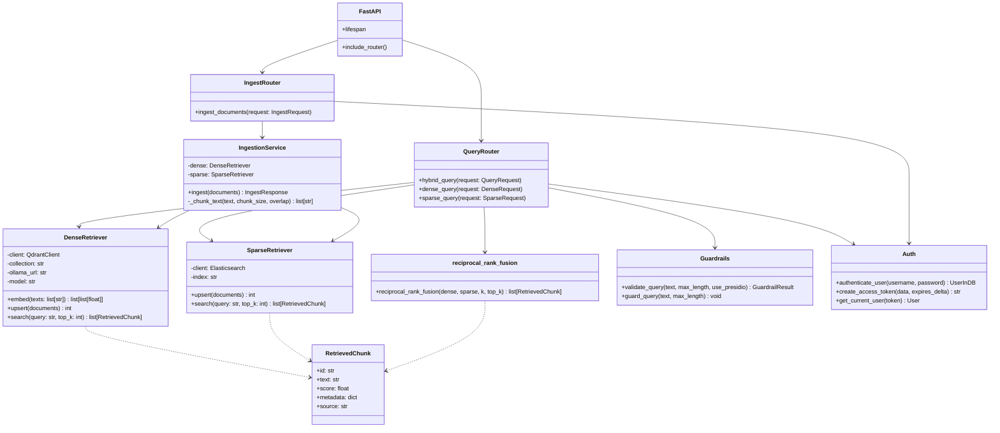

# C4 — Code Diagram: Hybrid RAG Backend

This diagram zooms into the key classes and functions that implement hybrid retrieval and ingestion.



## Key Code Paths

### Hybrid query

```python
# app/routers/query.py
@router.post("/hybrid", response_model=QueryResponse)
async def hybrid_query(
    request: QueryRequest,
    user: User = Depends(get_current_user),
    dense: DenseRetriever = Depends(_get_dense),
    sparse: SparseRetriever = Depends(_get_sparse),
) -> QueryResponse:
    guard_query(request.query)
    dense_results = await dense.search(request.query, request.top_k) if request.use_dense else []
    sparse_results = await sparse.search(request.query, request.top_k) if request.use_sparse else []
    results = reciprocal_rank_fusion(dense_results, sparse_results, top_k=request.top_k)
    return QueryResponse(query=request.query, results=results, latency_ms=...)
```

### Dense retrieval

```python
# app/retrieval/dense.py
async def search(self, query: str, top_k: int = 5) -> list[RetrievedChunk]:
    vectors = await self.embed([query])
    results = self.client.search(
        collection_name=self.collection,
        query_vector=vectors[0],
        limit=top_k,
        with_payload=True,
    )
    return [RetrievedChunk(..., source="dense") for r in results]
```

### Sparse retrieval

```python
# app/retrieval/sparse.py
async def search(self, query: str, top_k: int = 5) -> list[RetrievedChunk]:
    response = self.client.search(index=self.index, body={"query": {"match": {"text": query}}, "size": top_k})
    return [RetrievedChunk(..., source="sparse") for h in response["hits"]["hits"]]
```

### Reciprocal Rank Fusion

```python
# app/retrieval/fusion.py
def reciprocal_rank_fusion(dense_results, sparse_results, k=60, top_k=5):
    scores = defaultdict(float)
    for rank, chunk in enumerate(dense_results, start=1):
        scores[chunk.id] += 1 / (k + rank)
    for rank, chunk in enumerate(sparse_results, start=1):
        scores[chunk.id] += 1 / (k + rank)
    ranked = sorted(scores.items(), key=lambda x: x[1], reverse=True)[:top_k]
    return [RetrievedChunk(id=doc_id, ..., source="fusion") for doc_id, score in ranked]
```

### Ingestion with chunking

```python
# app/ingestion.py
async def ingest(self, documents: list[Document]) -> IngestResponse:
    for doc in documents:
        chunks = _chunk_text(doc.text)
        for idx, chunk in enumerate(chunks):
            chunk_id = f"{doc.id}::chunk::{idx}"
            meta = {**doc.metadata, "parent_id": doc.id, "chunk_index": idx}
            dense_docs.append({"id": chunk_id, "text": chunk, "metadata": meta})
            sparse_docs.append({"id": chunk_id, "text": chunk, "metadata": meta})
    await self.dense.upsert(dense_docs)
    await self.sparse.upsert(sparse_docs)
    return IngestResponse(indexed=len(dense_docs), errors=[])
```

## Notes

- The backend is intentionally modular: each retriever can be tested and replaced independently.
- The `RetrievedChunk` model is shared across dense, sparse, and fusion sources so the API response shape is consistent.
