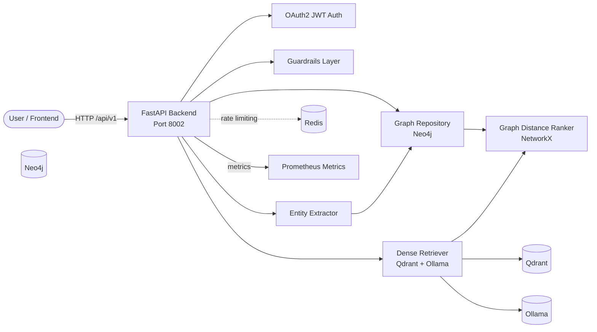

# 02-graph-rag

A production-template implementation of **Graph RAG** that combines dense vector retrieval (Qdrant + Ollama embeddings) with a **Neo4j knowledge graph** to improve retrieval through entity relationships and graph distance ranking. The backend is built with **FastAPI** and the frontend is a **Next.js 14** application with a chat UI and graph explorer.

This architecture is part of the [RAG Foundry](../README.md) monorepo and shares the root `docker-compose.yml`, `Makefile`, and `scripts/` tooling.

---

## Overview

Graph RAG addresses the limitations of pure vector retrieval when the answer depends on explicit relationships between entities:

- **Dense retrieval** captures semantic similarity between queries and text chunks.
- **Knowledge graph traversal** discovers chunks connected to query entities through multi-hop relationships.
- **Graph distance ranking** re-ranks vector candidates using the shortest path distance from query entities in Neo4j.

The template ships with:

| Layer | Technology | Purpose |
|-------|------------|---------|
| API Framework | FastAPI 0.110 | REST API, dependency injection, OpenAPI docs |
| Vector Store | Qdrant 1.9 | Cosine similarity over 768-dim embeddings |
| Knowledge Graph | Neo4j 5.19 | Entity/relationship storage and graph traversal |
| Graph Analysis | NetworkX | In-memory graph distance calculations |
| Embeddings / LLM | Ollama | Local `nomic-embed-text` and `llama3:8b` |
| Auth | JWT (python-jose) | Bearer-token auth with demo user |
| Guardrails | Regex + optional Presidio | Input length, prompt injection, PII, toxicity |
| Observability | Prometheus + OpenTelemetry + structlog | Metrics, traces, JSON logs |
| Rate Limiting | slowapi | Per-IP limits, Redis-backed in production |
| Infra | Terraform | Modules for bare-metal/VPS, AWS, Azure, GCP |

---

## Architecture Diagram



### Request Flow

1. Client authenticates via `/api/v1/auth/token` and receives a JWT.
2. Query is validated by guardrails (length, prompt injection, PII, toxicity).
3. Entities are extracted from the query using regex heuristics.
4. The query is embedded via Ollama and Qdrant returns top-K semantic chunks.
5. Neo4j traverses the graph from query entities to find nearby chunks.
6. NetworkX / graph distance logic re-ranks chunks by proximity and vector score.
7. Results are returned with per-request latency and source provenance (`graph`, `vector`, or `fusion`).

---

## Quick Start (Local)

### Prerequisites

- Docker + Docker Compose
- Python 3.12+ (for local development)
- Node.js 20+ (for frontend work)
- Ollama (or use the Ollama container in `docker-compose.yml`)
- `make` (optional)

The [`scripts/setup-local.sh`](../scripts/setup-local.sh) helper can install prerequisites on Debian/Ubuntu or macOS.

### 1. Start shared infrastructure

From the repository root (``):

```bash
docker compose up -d
```

This starts PostgreSQL, Redis, Qdrant, Elasticsearch, Neo4j, and Ollama.

### 2. Pull the embedding model

```bash
ollama pull nomic-embed-text
ollama pull llama3:8b
```

If using the Dockerised Ollama service:

```bash
docker exec -it rag-ollama ollama pull nomic-embed-text
docker exec -it rag-ollama ollama pull llama3:8b
```

### 3. Run the backend locally

```bash
cd backend
python -m venv .venv
source .venv/bin/activate
pip install -r requirements.txt
uvicorn app.main:app --reload --host 0.0.0.0 --port 8002
```

### 4. Verify the service

```bash
curl http://localhost:8002/health
curl http://localhost:8002/ready
```

### 5. Ingest and query

Authenticate:

```bash
TOKEN=$(curl -s -X POST http://localhost:8002/api/v1/auth/token \
  -H "Content-Type: application/x-www-form-urlencoded" \
  -d "username=demo&password=demo" | jq -r '.access_token')
```

Ingest a document:

```bash
curl -X POST http://localhost:8002/api/v1/ingest \
  -H "Authorization: Bearer $TOKEN" \
  -H "Content-Type: application/json" \
  -d '{
    "documents": [
      {
        "id": "doc-001",
        "text": "Graph RAG combines dense vector search with a Neo4j knowledge graph to improve recall.",
        "metadata": {"source": "readme"}
      }
    ]
  }'
```

Run a graph query:

```bash
curl -X POST http://localhost:8002/api/v1/query/graph \
  -H "Authorization: Bearer $TOKEN" \
  -H "Content-Type: application/json" \
  -d '{"query": "What is Graph RAG?", "top_k": 5}'
```

### 6. Run via Docker Compose (all services)

```bash
docker compose --profile apps up -d
```

This builds and starts the `02-graph-rag-backend` container on port `8002`.

### 7. Start the frontend

```bash
cd frontend
npm install
npm run dev
```

Open [http://localhost:3000](http://localhost:3000) and sign in with `demo` / `demo`.

---

## Deployment Guides

The `infra/` directory contains Terraform module scaffolds for each target platform. See the per-module README files for intended resources and deployment steps.

### Bare Metal / VPS

```bash
cd infra/bare-metal
terraform init
terraform apply -var="host=203.0.113.10" -var="ssh_user=ubuntu"
```

### AWS

```bash
cd infra/aws
terraform init
terraform apply -var="region=us-east-1" -var="environment=production"
```

### Azure

```bash
cd infra/azure
terraform init
terraform apply -var="location=westeurope" -var="environment=production"
```

### GCP

```bash
cd infra/gcp
terraform init
terraform apply -var="project_id=my-gcp-project" -var="region=us-central1"
```

---

## Testing

Backend tests use **pytest** with **pytest-asyncio**, **httpx**, **respx**, and **fakeredis**. The coverage gate is configured at **80%** in `pyproject.toml`.

### Run backend tests

```bash
cd backend
python -m pytest
```

### Run tests from the repo root

```bash
make test ARCH=02-graph-rag
```

### Test categories

| File | Coverage |
|------|----------|
| `tests/test_auth.py` | JWT token issuance and validation |
| `tests/test_guardrails.py` | Prompt injection, PII, toxicity, length checks |
| `tests/test_health.py` | `/health`, `/ready`, `/metrics` |
| `tests/test_ingestion.py` | Chunking, entity extraction, graph ingestion |
| `tests/test_llm.py` | Ollama generate client |
| `tests/test_query.py` | Graph query endpoint + guardrail blocking |
| `tests/test_graph.py` | Graph entity listing and expansion |
| `tests/test_retrieval.py` | Dense search and graph distance ranker |

### Lint and format

```bash
cd backend
ruff check .
ruff format .
mypy .
```

### Frontend tests

```bash
cd frontend
npm install
npm run test:ci
npm run lint
```

---

## Guardrails

The guardrails are layered in `backend/app/guardrails.py` and configured via YAML files in `guardrails/`.

### Implemented checks

1. **Input length** — rejects queries or documents exceeding configurable limits.
2. **Prompt injection** — regex heuristics for common instruction-override patterns.
3. **PII detection** — regex for SSN, credit card, email, phone; optional Presidio entities.
4. **Toxicity / content safety** — heuristic keyword lists; cloud API placeholders in `content-safety.yaml`.

### Configuration files

| File | Purpose |
|------|---------|
| `guardrails/input-schemas.json` | JSON Schema snippets for request validation |
| `guardrails/prompt-injection.yaml` | Heuristic patterns and optional LLM classifier |
| `guardrails/pii-rules.yaml` | Regex and Presidio entity rules |
| `guardrails/content-safety.yaml` | Content categories and severity thresholds |
| `guardrails/rate-limit-config.yaml` | Per-endpoint rate limits |
| `guardrails/entity-extraction.yaml` | Lightweight extractor configuration |

### Enabling Presidio PII checks

Set `USE_PRESIDIO=true` and ensure `presidio-analyzer` is installed (already in `requirements.txt`).

```bash
USE_PRESIDIO=true uvicorn app.main:app --reload
```

### Rate limiting

`slowapi` is wired into the FastAPI app and uses Redis when `REDIS_URL` points to a Redis backend.

---

## API Documentation (OpenAPI/Swagger)

FastAPI auto-generates interactive API documentation:

- **Swagger UI**: [http://localhost:8002/docs](http://localhost:8002/docs)
- **ReDoc**: [http://localhost:8002/redoc](http://localhost:8002/redoc)
- **OpenAPI JSON**: [http://localhost:8002/openapi.json](http://localhost:8002/openapi.json)

### Key endpoints

| Method | Path | Description | Auth |
|--------|------|-------------|------|
| GET | `/health` | Liveness probe | No |
| GET | `/ready` | Readiness probe with dependency checks | No |
| GET | `/metrics` | Prometheus metrics | No |
| POST | `/api/v1/auth/token` | OAuth2 password login | No |
| POST | `/api/v1/ingest` | Ingest documents into Qdrant + Neo4j | Bearer JWT |
| POST | `/api/v1/query/graph` | Dense + graph retrieval | Bearer JWT |
| GET | `/api/v1/graph/entities` | List graph entities | Bearer JWT |
| GET | `/api/v1/graph/expand/{entity_id}` | Expand an entity neighbourhood | Bearer JWT |

### Example request bodies

**Ingest:**

```json
{
  "documents": [
    {
      "id": "doc-001",
      "text": "Graph RAG merges vector search and knowledge graphs.",
      "metadata": {"source": "docs"}
    }
  ]
}
```

**Graph query:**

```json
{
  "query": "What is Graph RAG?",
  "top_k": 5,
  "graph_depth": 2
}
```

---

## Troubleshooting

### Backend fails to start with `ModuleNotFoundError`

Ensure you are inside the `backend/` directory and the virtual environment is activated:

```bash
cd backend
source .venv/bin/activate
pip install -r requirements.txt
```

### `Connection refused` to Neo4j or Qdrant

The services must be running. From the repo root:

```bash
docker compose ps
docker compose logs neo4j qdrant
```

If running the backend locally, verify `NEO4J_URI` and `QDRANT_URL` point to `localhost`.

### Ollama embeddings time out

First embedding request can be slow while the model loads. Pre-load the model:

```bash
ollama run nomic-embed-text
```

### Tests fail with coverage below 80%

Add or update tests, then run:

```bash
cd backend
python -m pytest --cov=app --cov-report=term-missing
```

---

## Related Documentation

- [Architecture Decision Records](./adr/)
- [C4 Diagrams](./c4/)
- [Root RAG Foundry README](../README.md)
- [System Landscape C4](../docs/c4/system-landscape.md)
