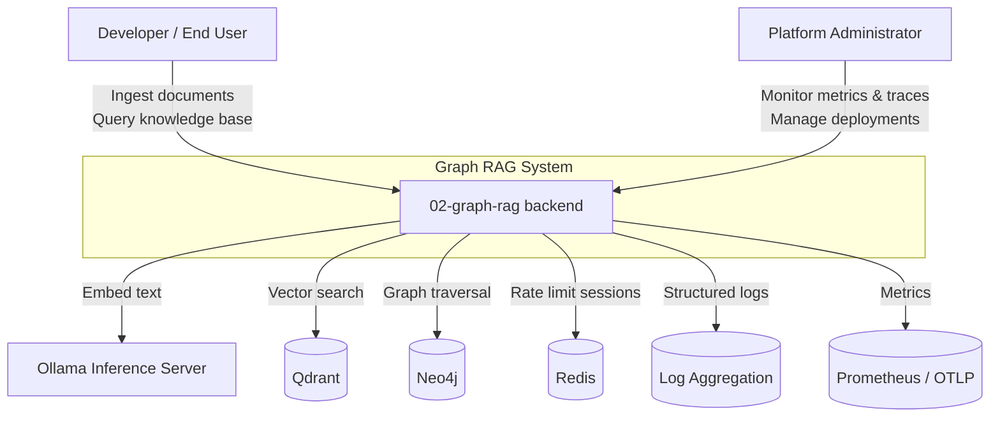

# C1 — System Context: Graph RAG

This diagram shows the Graph RAG system in its broader environment, including the users and external systems it interacts with.

## Description

- **Developer / End User**: consumes the REST API (directly or via the Next.js frontend) to ingest documents and run graph queries.
- **Platform Administrator**: deploys, monitors, and secures the system.
- **Graph RAG backend**: the FastAPI application at the centre of the architecture.
- **Ollama**: local embedding and LLM inference server.
- **Qdrant**: dense vector database.
- **Neo4j**: knowledge graph database.
- **Redis**: session/rate-limit cache.
- **Log Aggregation / Prometheus / OTLP**: observability sinks for JSON logs, metrics, and traces.
