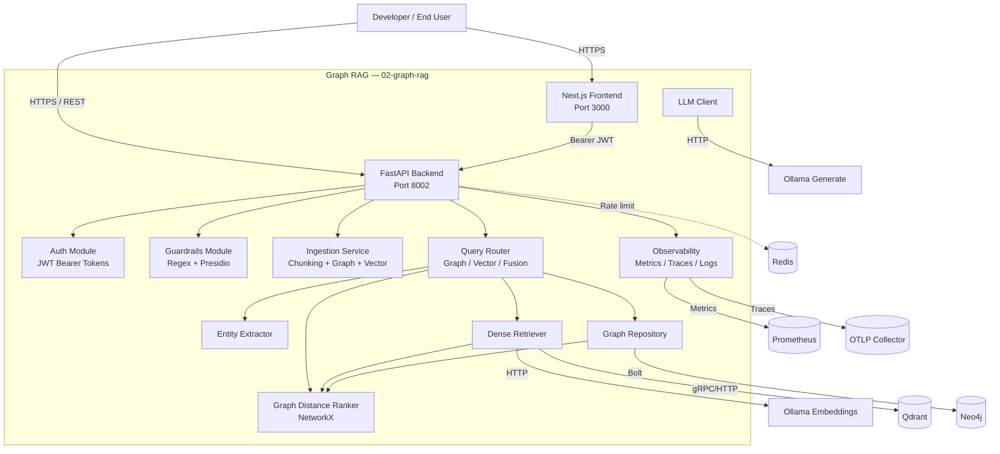

# C2 — Container Diagram: Graph RAG

This diagram decomposes the Graph RAG system into its major deployable containers and data stores.

## Container Responsibilities

| Container | Responsibility |
|-----------|----------------|
| Next.js Frontend | Browser UI for login, chat, ingestion, and graph exploration. |
| FastAPI Backend | HTTP API routing, middleware, exception handling. |
| Auth Module | Issue and validate JWT access tokens. |
| Guardrails Module | Input validation and safety checks. |
| Ingestion Service | Sliding-window chunking, entity extraction, dual indexing into Qdrant and Neo4j. |
| Query Router | Orchestrates graph-aware retrieval endpoints. |
| Entity Extractor | Regex-based extraction of candidate entities from text. |
| Dense Retriever | Embeds text via Ollama and searches Qdrant. |
| Graph Repository | Persists and queries the Neo4j knowledge graph. |
| Graph Distance Ranker | Combines vector scores with graph proximity using NetworkX. |
| LLM Client | Wraps Ollama `/api/generate` for future generation features. |
| Observability | Prometheus metrics, OpenTelemetry traces, structlog JSON logs. |
