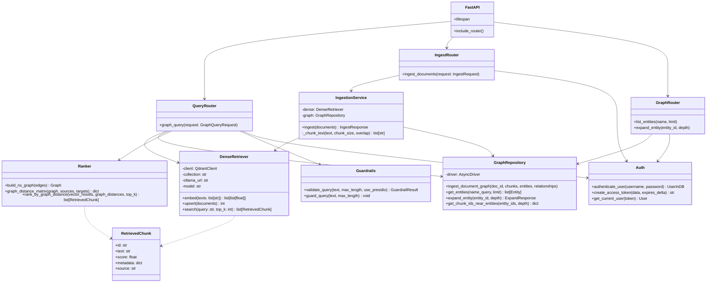

# C4 — Code Diagram: Graph RAG Backend

This diagram zooms into the key classes and functions that implement graph retrieval and ingestion.



## Key Code Paths

### Graph query

```python
# app/routers/query.py
@router.post("/graph", response_model=QueryResponse)
async def graph_query(
    request: GraphQueryRequest,
    user: User = Depends(get_current_user),
    dense: DenseRetriever = Depends(_get_dense),
    graph: GraphRepository = Depends(_get_graph),
) -> QueryResponse:
    guard_query(request.query)
    query_entities = extract_entities(request.query, chunk_id="query")
    vector_results = await dense.search(request.query, top_k=request.top_k * 2)
    graph_distances = await graph.get_chunk_ids_near_entities(
        [e["id"] for e in query_entities], depth=request.graph_depth
    )
    results = rank_by_graph_distance(vector_results, graph_distances, top_k=request.top_k)
    return QueryResponse(query=request.query, results=results, latency_ms=...)
```

### Graph ingestion

```python
# app/ingestion.py
async def ingest(self, documents: list[Document]) -> IngestResponse:
    for doc in documents:
        chunks = _chunk_text(doc.text)
        for idx, chunk_text in enumerate(chunks):
            chunk_id = f"{doc.id}::chunk::{idx}"
            entities = extract_entities(chunk_text, chunk_id)
            relationships = build_relationships(entities, chunk_id)
            await self.dense.upsert([...])
            await self.graph.ingest_document_graph(
                doc.id, chunks, entities, relationships
            )
    return IngestResponse(indexed=..., entities_created=..., relationships_created=...)
```

### Graph distance ranking

```python
# app/retrieval/ranker.py
def rank_by_graph_distance(vector_results, graph_distances, top_k=5, distance_weight=0.5):
    scored = []
    for chunk in vector_results:
        distance = graph_distances.get(chunk.id)
        graph_score = 1.0 / (1.0 + distance) if distance is not None else 0
        combined = (1 - distance_weight) * chunk.score + distance_weight * graph_score
        scored.append((combined, chunk))
    scored.sort(key=lambda x: x[0], reverse=True)
    return [chunk for _, chunk in scored[:top_k]]
```

## Notes

- The backend is intentionally modular: each retriever and the graph repository can be tested and replaced independently.
- The `RetrievedChunk` model is shared across vector and graph sources so the API response shape is consistent.
