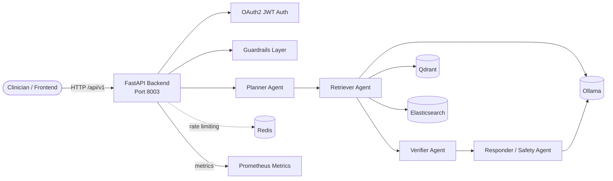

# 03-agentic-rag-hospital

A production-template implementation of **Agentic RAG** for hospital medical QA. The backend uses **FastAPI** and a **LangGraph/LangChain** multi-agent pipeline with planner, retriever, verifier, and responder (safety) agents. It retrieves from both dense (Qdrant + Ollama embeddings) and sparse (Elasticsearch BM25) indexes, fuses results with **Reciprocal Rank Fusion (RRF)**, and returns observable reasoning steps with every answer.

This architecture is part of the [RAG Foundry](../README.md) monorepo and shares the root `docker-compose.yml`, `Makefile`, and `scripts/` tooling.

---

## Overview

Agentic RAG Hospital addresses the need for transparent, safety-first medical question answering:

- **Planner agent** decides how to answer and produces a focused retrieval query.
- **Retriever agent** performs hybrid dense + sparse retrieval and boosts patient-specific sources.
- **Verifier agent** checks safety, coverage, and guardrail compliance.
- **Responder / safety agent** generates an educational answer or refuses unsafe queries and appends a medical disclaimer.
- **Observable state** — every response includes the plan, per-agent reasoning steps, sources, and safety status.

The template ships with:

| Layer | Technology | Purpose |
|-------|------------|---------|
| API Framework | FastAPI 0.110 | REST API, dependency injection, auto-generated OpenAPI docs |
| Agent Orchestration | LangGraph 0.1 / LangChain 0.2 | Multi-agent state graph |
| Dense Store | Qdrant 1.9 | Vector search with cosine similarity, 768-dim embeddings |
| Sparse Store | Elasticsearch 8.13 | BM25 lexical search |
| Embeddings / LLM | Ollama | Local `nomic-embed-text` embeddings and `llama3:8b` generation |
| Auth | JWT (python-jose) | Bearer-token auth with a demo user (replace in production) |
| Guardrails | Regex + optional Presidio + medical safety | Input length, prompt injection, PII, toxicity, medical-advice detection |
| Observability | Prometheus + OpenTelemetry + structlog | Metrics, distributed traces, structured JSON logs |
| Rate Limiting | slowapi | Per-IP rate limits (Redis-backed in production) |
| Patient Data | FHIR R4 JSON | Mock patient records under `data/patients/` |
| Infra (scaffold) | Terraform | Modules for bare-metal/VPS, AWS, Azure, and GCP |
| Frontend | Next.js 14 + shadcn/ui | Medical chat UI with agent reasoning display |

---

## Architecture Diagram



### Request Flow

1. Client authenticates via `/api/v1/auth/token` and receives a JWT.
2. Query is validated by guardrails (length, prompt injection, PII, toxicity, medical advice).
3. The planner agent creates a plan and a focused retrieval query.
4. The retriever agent embeds the query via Ollama, searches Qdrant, searches Elasticsearch BM25, and fuses results with RRF.
5. The verifier agent checks that sources cover the query and flags safety concerns.
6. The responder agent generates a safe, educational answer or refuses the query, appending a medical disclaimer when needed.
7. The response includes the answer, plan, reasoning steps, sources, safety status, and latency.

---

## Quick Start (Local)

### Prerequisites

- Docker + Docker Compose
- Python 3.12+ (for local development)
- Node.js 20+ (for frontend work)
- Ollama (or use the Ollama container in `docker-compose.yml`)
- `make` (optional, for shared scripts)

The [`scripts/setup-local.sh`](../scripts/setup-local.sh) helper can install the prerequisites on Debian/Ubuntu or macOS.

### 1. Start shared infrastructure

From the repository root (``):

```bash
docker compose up -d
```

This starts PostgreSQL, Redis, Qdrant, Elasticsearch, Neo4j, and Ollama.

### 2. Pull the embedding model

```bash
ollama pull nomic-embed-text
ollama pull llama3:8b
```

If you are using the Dockerised Ollama service, run:

```bash
docker exec -it rag-ollama ollama pull nomic-embed-text
docker exec -it rag-ollama ollama pull llama3:8b
```

### 3. Run the backend locally

```bash
cd backend
python -m venv .venv
source .venv/bin/activate
pip install -r requirements.txt
uvicorn app.main:app --reload --host 0.0.0.0 --port 8003
```

### 4. Verify the service

```bash
curl http://localhost:8003/health
curl http://localhost:8003/ready
```

### 5. Authenticate and query

Authenticate:

```bash
TOKEN=$(curl -s -X POST http://localhost:8003/api/v1/auth/token \
  -H "Content-Type: application/x-www-form-urlencoded" \
  -d "username=demo&password=demo" | jq -r '.access_token')
```

Ask the agent:

```bash
curl -X POST http://localhost:8003/api/v1/query/agent \
  -H "Authorization: Bearer $TOKEN" \
  -H "Content-Type: application/json" \
  -d '{"query": "What is metformin used for?", "patient_id": "pat-001", "top_k": 3}'
```

The response contains `answer`, `plan`, `reasoning`, `sources`, and `safety_checks_passed`.

### 6. Ingest documents

```bash
curl -X POST http://localhost:8003/api/v1/ingest \
  -H "Authorization: Bearer $TOKEN" \
  -H "Content-Type: application/json" \
  -d '{
    "documents": [
      {
        "id": "med-001",
        "text": "Metformin is a first-line medication for type 2 diabetes mellitus.",
        "metadata": {"source": "clinical-guidelines"}
      }
    ]
  }'
```

### 7. View a patient summary

```bash
curl http://localhost:8003/api/v1/patients/pat-001 \
  -H "Authorization: Bearer $TOKEN"
```

### 8. Start the frontend

```bash
cd frontend
npm install
npm run dev
```

Open [http://localhost:3000](http://localhost:3000) and sign in with `demo` / `demo`.

---

## Deployment Guides

The `infra/` directory contains Terraform module scaffolds for each target platform. The following guides describe the intended resources and deployment steps. Each module is a starting point; extend it with your VPC/VNet/networking, TLS certificates, DNS, and secrets management.

### Bare Metal / VPS

Best for: self-hosted labs, single-tenant deployments, or air-gapped environments.

Provisioned resources:

- Docker Engine on the target host.
- `docker-compose.yml` deployed via Terraform `local_file`.
- systemd service units for the backend and Nginx.
- Optional Certbot/Let's Encrypt for HTTPS.

Deploy:

```bash
cd infra/bare-metal
terraform init
terraform apply -var="host=203.0.113.10" -var="ssh_user=ubuntu"
```

### AWS

Best for: scalable, managed production deployments.

Provisioned resources (intended module):

- VPC, public/private subnets, NAT gateway.
- ECS Fargate service for the FastAPI backend.
- Amazon OpenSearch Service for sparse retrieval (or self-managed Elasticsearch on EC2).
- Amazon Qdrant on EC2 or a managed vector store.
- ElastiCache (Redis) for rate limiting.
- Secrets Manager for JWT secret and service credentials.
- Application Load Balancer with TLS.

Deploy:

```bash
cd infra/aws
terraform init
terraform apply -var="region=us-east-1" -var="environment=production"
```

### Azure

Best for: Microsoft-centric organisations or Azure OpenAI integration.

Provisioned resources (intended module):

- Resource group and VNet.
- Azure Container Apps or AKS for the backend.
- Azure Cognitive Search for sparse lexical retrieval.
- Azure Cache for Redis.
- Azure Container Registry for images.
- Azure Key Vault for secrets.
- Application Gateway or Front Door for TLS/load balancing.

Deploy:

```bash
cd infra/azure
terraform init
terraform apply -var="location=westeurope" -var="environment=production"
```

### GCP

Best for: Kubernetes-native teams or BigQuery-integrated pipelines.

Provisioned resources (intended module):

- VPC and subnets.
- Cloud Run or GKE for the backend.
- Vertex AI Vector Search or self-managed Qdrant on Compute Engine.
- Elasticsearch on Compute Engine or Elastic Cloud on GCP.
- Memorystore (Redis) for rate limiting.
- Secret Manager for credentials.
- Cloud Load Balancing for HTTPS.

Deploy:

```bash
cd infra/gcp
terraform init
terraform apply -var="project_id=my-gcp-project" -var="region=us-central1"
```

---

## Testing

Backend tests use **pytest** with **pytest-asyncio**, **httpx**, **respx**, and **fakeredis**. The coverage gate is configured at **80%** in `pyproject.toml`.

### Run backend tests

```bash
cd backend
python -m pytest
```

### Run tests from the repo root

```bash
# All architectures
make test

# Only this architecture
make test ARCH=03-agentic-rag-hospital
```

### Test categories

| File | Coverage |
|------|----------|
| `tests/test_auth.py` | JWT token issuance and validation |
| `tests/test_guardrails.py` | Prompt injection, PII, toxicity, medical safety |
| `tests/test_health.py` | `/health`, `/ready`, `/metrics` |
| `tests/test_ingestion.py` | Document chunking and dual indexing |
| `tests/test_llm.py` | Ollama generate and embed client |
| `tests/test_query.py` | Agent query endpoint + guardrail blocking |
| `tests/test_agents.py` | Planner, retriever, verifier, responder nodes |
| `tests/test_patients.py` | FHIR patient summary endpoint |
| `tests/test_retrieval.py` | Qdrant and Elasticsearch retriever unit tests |
| `../tests/test_integration.py` | End-to-end API integration tests |

### Lint and format

```bash
cd backend
ruff check .
ruff format .
mypy .
```

### Frontend tests

```bash
cd frontend
npm install
npm run test:ci
npm run lint
```

---

## Guardrails

The guardrails are layered in `backend/app/guardrails.py` and configured via YAML files in `guardrails/`.

### Implemented checks

1. **Input length** — rejects queries or documents exceeding configurable limits.
2. **Prompt injection** — regex heuristics for common instruction-override patterns.
3. **PII detection** — regex for SSN, credit card, email, phone, patient names; optional Presidio entities.
4. **Toxicity / content safety** — heuristic keyword lists; cloud API placeholders in `content-safety.yaml`.
5. **Medical advice detection** — flags requests that ask for personal diagnosis or treatment recommendations.
6. **Verifier agent** — LLM-based assessment of whether the query can be safely answered from retrieved sources.
7. **Responder agent** — refuses unsafe queries and appends a medical disclaimer to educational answers.

### Configuration files

| File | Purpose |
|------|---------|
| `guardrails/input-schemas.json` | JSON Schema snippets for request validation |
| `guardrails/prompt-injection.yaml` | Heuristic patterns and optional LLM-based classifier |
| `guardrails/pii-rules.yaml` | Regex and Presidio entity rules |
| `guardrails/content-safety.yaml` | Content categories and severity thresholds |
| `guardrails/medical-safety.yaml` | Medical advice patterns and disclaimer/refusal rules |
| `guardrails/rate-limit-config.yaml` | Per-endpoint rate limits |

### Enabling Presidio PII checks

Set the `USE_PRESIDIO=true` environment variable and ensure `presidio-analyzer` is installed (already in `requirements.txt`).

```bash
USE_PRESIDIO=true uvicorn app.main:app --reload
```

### Rate limiting

`slowapi` is wired into the FastAPI app. In production, configure a Redis-backed storage backend for slowapi and align it with `guardrails/rate-limit-config.yaml`.

---

## API Documentation (OpenAPI/Swagger)

FastAPI auto-generates interactive API documentation:

- **Swagger UI**: [http://localhost:8003/docs](http://localhost:8003/docs)
- **ReDoc**: [http://localhost:8003/redoc](http://localhost:8003/redoc)
- **OpenAPI JSON**: [http://localhost:8003/openapi.json](http://localhost:8003/openapi.json)

### Key endpoints

| Method | Path | Description | Auth |
|--------|------|-------------|------|
| GET | `/health` | Liveness probe | No |
| GET | `/ready` | Readiness probe with dependency checks | No |
| GET | `/metrics` | Prometheus metrics | No |
| POST | `/api/v1/auth/token` | OAuth2 password login | No |
| POST | `/api/v1/ingest` | Ingest documents into both indexes | Bearer JWT |
| POST | `/api/v1/query/agent` | Multi-agent medical QA | Bearer JWT |
| GET | `/api/v1/agents/status` | Agent graph status | Bearer JWT |
| GET | `/api/v1/patients/{id}` | FHIR patient summary | Bearer JWT |

### Example request bodies

**Agent query:**

```json
{
  "query": "What is metformin used for?",
  "patient_id": "pat-001",
  "top_k": 3
}
```

**Agent query response:**

```json
{
  "query": "What is metformin used for?",
  "answer": "Metformin is a first-line medication for type 2 diabetes mellitus...\n\nDisclaimer: This information is for educational purposes only...",
  "plan": ["Analyze the question", "Retrieve relevant records", "Verify safety", "Generate educational response"],
  "reasoning": [
    {"agent": "planner", "step": "created_plan", "detail": {"retrieval_query": "metformin indications diabetes"}},
    {"agent": "retriever", "step": "retrieved_sources", "detail": {"count": 3}},
    {"agent": "verifier", "step": "verified_safety", "detail": {"safe_to_answer": true}},
    {"agent": "responder", "step": "generated_answer", "detail": {"length": 256}}
  ],
  "sources": [
    {"id": "med-001::chunk::0", "text": "Metformin is a first-line medication...", "score": 0.95, "metadata": {"source": "clinical-guidelines"}, "source": "fusion"}
  ],
  "safety_checks_passed": true,
  "disclaimer": "Medical advice disclaimer appended.",
  "latency_ms": 1234.5
}
```

---

## Troubleshooting

### Backend fails to start with `ModuleNotFoundError`

Ensure you are inside the `backend/` directory and the virtual environment is activated:

```bash
cd backend
source .venv/bin/activate
pip install -r requirements.txt
```

### `Connection refused` to Qdrant or Elasticsearch

The services must be running. From the repo root:

```bash
docker compose ps
docker compose logs qdrant elasticsearch
```

If running the backend locally, verify `QDRANT_URL` and `ELASTICSEARCH_URL` point to `localhost`.

### Ollama generation times out

First request can be slow while the model loads. Increase the timeout or pre-load the model:

```bash
ollama run llama3:8b
```

### Tests fail with coverage below 80%

Add or update tests, then run:

```bash
cd backend
python -m pytest --cov=app --cov-report=term-missing
```

---

## Related Documentation

- [Architecture Decision Records](./adr/)
- [C4 Diagrams](./c4/)
- [Root RAG Foundry README](../README.md)
- [System Landscape C4](../docs/c4/system-landscape.md)
