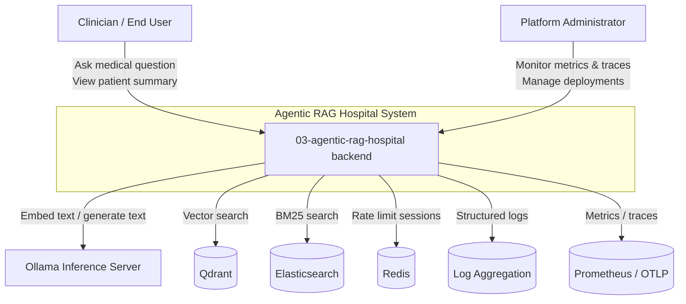

# C1 — System Context: Agentic RAG Hospital

This diagram shows the Agentic RAG Hospital system in its broader environment, including users and external systems.

## Description

- **Clinician / End User**: consumes the REST API (directly or via the Next.js frontend) to ask medical questions and view patient summaries.
- **Platform Administrator**: deploys, monitors, and secures the system.
- **Agentic RAG Hospital backend**: the FastAPI application orchestrating planner, retriever, verifier, and responder agents.
- **Ollama**: local embedding and LLM inference server.
- **Qdrant**: dense vector database.
- **Elasticsearch**: sparse lexical database.
- **Redis**: session/rate-limit cache.
- **Log Aggregation / Prometheus / OTLP**: observability sinks for JSON logs, metrics, and traces.
