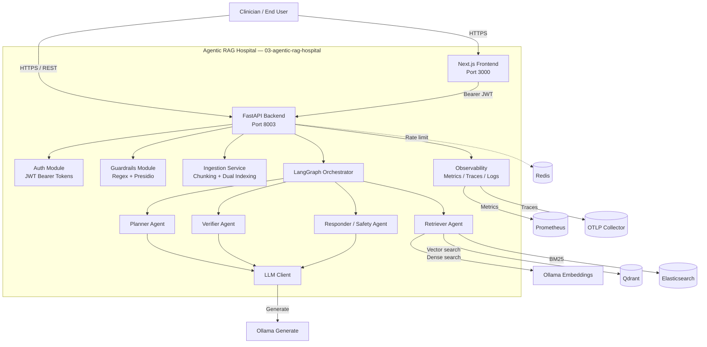

# C2 — Container Diagram: Agentic RAG Hospital

This diagram decomposes the system into its major deployable containers and data stores.

## Container Responsibilities

| Container | Responsibility |
|-----------|----------------|
| Next.js Frontend | Browser UI for medical chat, agent reasoning display, ingestion, and patient lookup. |
| FastAPI Backend | HTTP API routing, middleware, exception handling. |
| Auth Module | Issue and validate JWT access tokens. |
| Guardrails Module | Input validation and safety checks. |
| Ingestion Service | Sliding-window chunking and dual indexing into Qdrant and Elasticsearch. |
| Planner Agent | Decides the answering plan and produces a retrieval query. |
| Retriever Agent | Performs hybrid dense + sparse retrieval. |
| Verifier Agent | Checks facts and safety against retrieved sources. |
| Responder Agent | Generates a safe, educational answer or refuses unsafe queries. |
| LangGraph Orchestrator | Manages shared state and transitions between agents. |
| LLM Client | Wraps Ollama `/api/generate` for agent nodes. |
| Observability | Prometheus metrics, OpenTelemetry traces, structlog JSON logs. |
