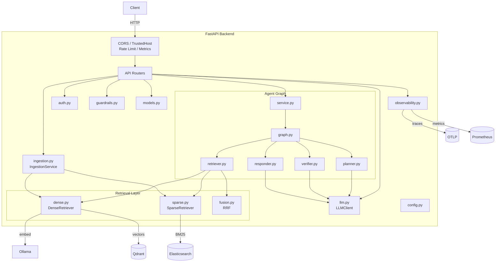

# C3 — Component Diagram: Agentic RAG Hospital Backend

This diagram shows the internal components of the FastAPI backend container.

## Component Responsibilities

| Component | File | Responsibility |
|-----------|------|----------------|
| API Routers | `app/routers/*.py` | Expose `/health`, `/ready`, `/metrics`, `/api/v1/auth`, `/api/v1/ingest`, `/api/v1/query/agent`, `/api/v1/agents/status`, `/api/v1/patients/{id}`. |
| Middleware | `app/main.py` | CORS, trusted host, SlowAPI rate limiting, Prometheus metrics. |
| Auth | `app/auth.py` | JWT token creation/validation and demo user database. |
| Guardrails | `app/guardrails.py` | Length, prompt injection, PII, toxicity, and medical-advice checks. |
| Models | `app/models.py` | Pydantic request/response schemas. |
| Planner Agent | `app/agents/planner.py` | Creates an answering plan and retrieval query. |
| Retriever Agent | `app/agents/retriever.py` | Hybrid dense + sparse retrieval with patient boosting. |
| Verifier Agent | `app/agents/verifier.py` | Safety and coverage verification. |
| Responder Agent | `app/agents/responder.py` | Generates answers or refuses unsafe queries. |
| Graph | `app/agents/graph.py` | Compiles and runs the LangGraph state machine. |
| Service | `app/agents/service.py` | FastAPI-friendly wrapper around the graph. |
| Dense Retriever | `app/retrieval/dense.py` | Ollama embedding + Qdrant cosine search. |
| Sparse Retriever | `app/retrieval/sparse.py` | Elasticsearch BM25 search. |
| RRF Fusion | `app/retrieval/fusion.py` | Reciprocal Rank Fusion of ranked chunk lists. |
| Ingestion Service | `app/ingestion.py` | Chunking and dual-index upsert. |
| LLM Client | `app/llm.py` | Ollama generation and embedding client. |
| Observability | `app/observability.py` | Structlog, OpenTelemetry, Prometheus registry. |
| Config | `app/config.py` | Pydantic-settings based configuration. |
