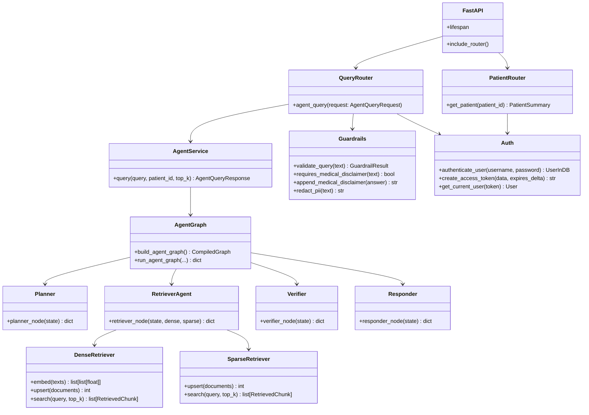

# C4 — Code Diagram: Agentic RAG Hospital Backend

This diagram zooms into the key classes and functions that implement the multi-agent medical QA pipeline.



## Key Code Paths

### Agent query

```python
# app/routers/query.py
@router.post("/agent", response_model=AgentQueryResponse)
async def agent_query(
    request: AgentQueryRequest,
    user: User = Depends(get_current_user),
    service: AgentService = Depends(_get_agent_service),
) -> AgentQueryResponse:
    guard_query(request.query)
    return await service.query(request.query, request.patient_id, request.top_k)
```

### Graph execution

```python
# app/agents/graph.py
async def run_agent_graph(query, patient_id=None, top_k=5):
    graph = build_agent_graph()
    return await graph.ainvoke({"query": query, "patient_id": patient_id, "reasoning": []})
```

### Safety check

```python
# app/agents/verifier.py
verification = await verifier_node(state)
if not verification["verification"]["safe_to_answer"]:
    return {"answer": "I'm unable to answer this question...", "safety_checks_passed": False}
```

## Notes

- The backend is modular: each agent and retriever can be tested independently.
- The `AgentQueryResponse` returns reasoning steps and sources alongside the answer for transparency.
