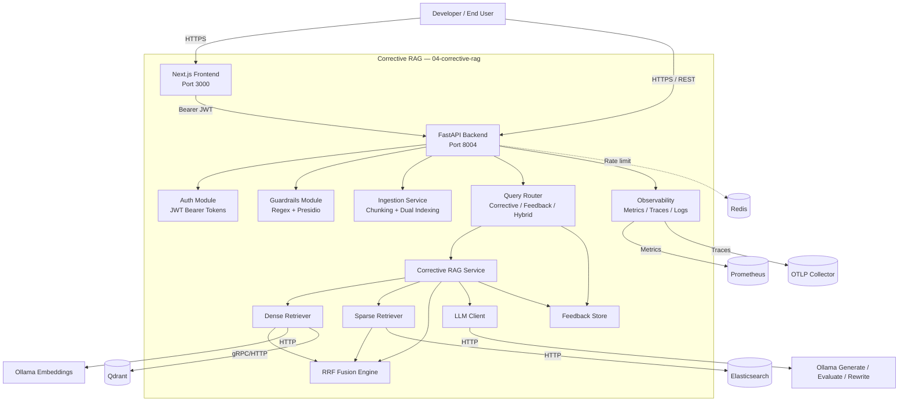

# C2 — Container Diagram: Corrective RAG

This diagram decomposes the Corrective RAG system into its major deployable containers and data stores.

## Container Responsibilities

| Container | Responsibility |
|-----------|----------------|
| Next.js Frontend | Browser UI for ingestion, corrective queries, iteration inspection, and feedback. |
| FastAPI Backend | HTTP API routing, middleware, exception handling. |
| Auth Module | Issue and validate JWT access tokens. |
| Guardrails Module | Input validation and safety checks. |
| Ingestion Service | Sliding-window chunking and dual indexing into Qdrant and Elasticsearch. |
| Query Router | Orchestrates corrective, feedback, hybrid, dense, and sparse endpoints. |
| Corrective RAG Service | Runs the confidence-driven rewrite/re-retrieve loop and generates answers. |
| Feedback Store | Records user feedback and computes per-result helpfulness scores. |
| Dense Retriever | Embeds text via Ollama and searches Qdrant. |
| Sparse Retriever | Searches Elasticsearch with BM25. |
| RRF Fusion Engine | Combines ranked lists using Reciprocal Rank Fusion. |
| LLM Client | Wraps Ollama for generation, relevance evaluation, and query rewriting. |
| Observability | Prometheus metrics, OpenTelemetry traces, structlog JSON logs. |
