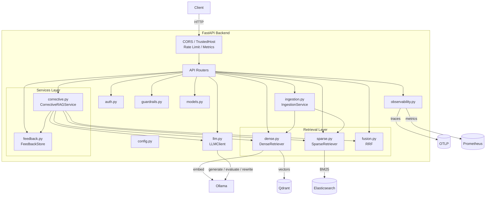

# C3 — Component Diagram: Corrective RAG Backend

This diagram shows the internal components of the FastAPI backend container.

## Component Responsibilities

| Component | File | Responsibility |
|-----------|------|----------------|
| API Routers | `app/routers/*.py` | Expose `/health`, `/ready`, `/metrics`, `/api/v1/auth`, `/api/v1/ingest`, `/api/v1/query/*`. |
| Middleware | `app/main.py` | CORS, trusted host, SlowAPI rate limiting, Prometheus metrics. |
| Auth | `app/auth.py` | JWT token creation/validation and demo user database. |
| Guardrails | `app/guardrails.py` | Length, prompt injection, PII, toxicity, and metadata checks. |
| Models | `app/models.py` | Pydantic request/response schemas. |
| Dense Retriever | `app/retrieval/dense.py` | Ollama embedding + Qdrant cosine search. |
| Sparse Retriever | `app/retrieval/sparse.py` | Elasticsearch BM25 search. |
| RRF Fusion | `app/retrieval/fusion.py` | Reciprocal Rank Fusion of ranked chunk lists. |
| Corrective RAG Service | `app/services/corrective.py` | Confidence scoring, rewrite loop, answer generation, feedback boost. |
| Feedback Store | `app/services/feedback.py` | Mock Postgres/Redis feedback persistence and scoring. |
| Ingestion Service | `app/ingestion.py` | Chunking and dual-index upsert. |
| LLM Client | `app/llm.py` | Ollama generation, relevance evaluation, and query rewriting. |
| Observability | `app/observability.py` | Structlog, OpenTelemetry, Prometheus registry. |
| Config | `app/config.py` | Pydantic-settings based configuration. |
