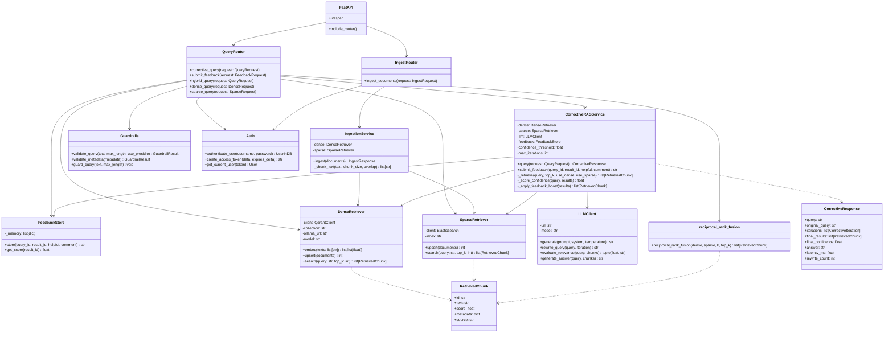

# C4 — Code Diagram: Corrective RAG Backend

This diagram zooms into the key classes and functions that implement corrective retrieval, feedback, and ingestion.



## Key Code Paths

### Corrective query

```python
# app/routers/query.py
@router.post("/corrective", response_model=CorrectiveResponse)
async def corrective_query(
    request: QueryRequest,
    user: User = Depends(get_current_user),
    service: CorrectiveRAGService = Depends(_get_corrective_service),
) -> CorrectiveResponse:
    guard_query(request.query)
    response = await service.query(request)
    CORRECTIVE_ITERATIONS.observe(len(response.iterations))
    CONFIDENCE_SCORE.observe(response.final_confidence)
    return response
```

### Confidence-driven loop

```python
# app/services/corrective.py
async def query(self, request: QueryRequest) -> CorrectiveResponse:
    for iteration in range(1, self.max_iterations + 1):
        results = await self._retrieve(current_query, request.top_k, ...)
        results = await self._apply_feedback_boost(results)
        confidence = await self._score_confidence(current_query, results)
        iterations.append(CorrectiveIteration(...))
        if confidence >= self.confidence_threshold:
            break
        if iteration < self.max_iterations:
            current_query = await self.llm.rewrite_query(original_query, iteration)
    answer = await self.llm.generate_answer(original_query, ...)
    return CorrectiveResponse(...)
```

### Relevance evaluation

```python
# app/llm.py
async def evaluate_relevance(self, query: str, chunks: list[dict]) -> tuple[float, str]:
    system = "Respond with JSON containing 'confidence' and 'reason'."
    prompt = f"Query: {query}\n\nPassages: ..."
    raw = await self.generate(prompt, system=system, temperature=0.1)
    return self._parse_confidence(raw)
```

### Feedback boost

```python
# app/services/corrective.py
async def _apply_feedback_boost(self, results: list[RetrievedChunk]) -> list[RetrievedChunk]:
    scored = []
    for r in results:
        feedback_score = await self.feedback.get_score(r.id)
        boosted = r.score + (0.05 * feedback_score)
        scored.append(RetrievedChunk(..., score=max(0.0, boosted)))
    scored.sort(key=lambda x: x.score, reverse=True)
    return scored
```

### Feedback submission

```python
# app/routers/query.py
@router.post("/feedback", response_model=FeedbackResponse)
async def submit_feedback(
    request: FeedbackRequest,
    store: FeedbackStore = Depends(_get_feedback_store),
) -> FeedbackResponse:
    feedback_id = await store.store(request.query_id, request.result_id, request.helpful, request.comment)
    FEEDBACK_COUNT.labels(helpful=str(request.helpful).lower()).inc()
    return FeedbackResponse(stored=True, feedback_id=feedback_id)
```

## Notes

- The backend is intentionally modular: each retriever, the LLM client, and the feedback store can be tested and replaced independently.
- The `CorrectiveRAGService` is designed so the rewrite loop, confidence scorer, and feedback booster are separate, testable methods.
- The `FeedbackStore` uses an in-memory mock by default; replace it with a PostgreSQL/Redis implementation in production.
