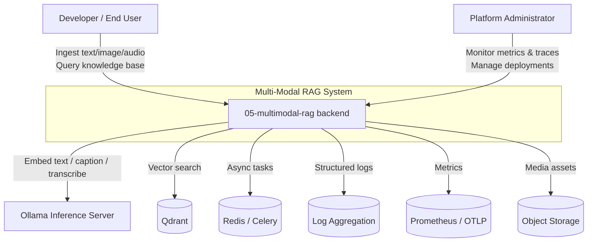

# C1 — System Context: Multi-Modal RAG

This diagram shows the Multi-Modal RAG system in its broader environment, including users and external systems.

## Description

- **Developer / End User**: consumes the REST API (directly or via the Next.js frontend) to ingest multimodal content and run queries.
- **Platform Administrator**: deploys, monitors, and secures the system.
- **Multi-Modal RAG backend**: the FastAPI application that orchestrates ingestion, embedding, retrieval, and async processing.
- **Ollama**: local embedding, image captioning, and transcription inference server.
- **Qdrant**: unified dense vector database for text, image, and audio.
- **Redis**: rate-limit cache and Celery broker/result backend.
- **Object Storage**: optional storage for uploaded media assets.
- **Log Aggregation / Prometheus / OTLP**: observability sinks.
