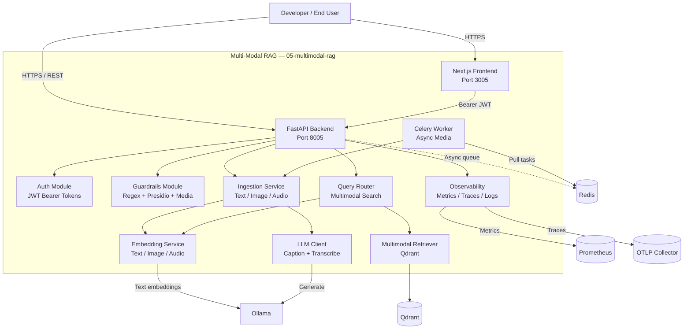

# C2 — Container Diagram: Multi-Modal RAG

This diagram decomposes the Multi-Modal RAG system into its major deployable containers and data stores.

## Container Responsibilities

| Container | Responsibility |
|-----------|----------------|
| Next.js Frontend | Browser UI for auth, multimodal ingestion, query, and result gallery. |
| FastAPI Backend | HTTP API routing, middleware, exception handling, rate limiting. |
| Auth Module | Issue and validate JWT access tokens. |
| Guardrails Module | Text and media input validation and safety checks. |
| Ingestion Service | Text chunking, image captioning, audio transcription, and upsert. |
| Query Router | `/api/v1/query/multimodal` orchestration. |
| Embedding Service | modality-aware embeddings with Ollama fallback. |
| Multimodal Retriever | Qdrant dense search with modality filters. |
| LLM Client | Ollama wrappers for captioning and transcription. |
| Celery Worker | Async processing of image/audio ingestion tasks. |
| Observability | Prometheus metrics, OpenTelemetry traces, structlog JSON logs. |
