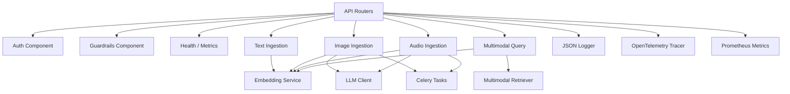

# C3 — Component Diagram: Multi-Modal RAG Backend

This diagram shows the internal components of the FastAPI backend.

## Component Responsibilities

- **API Routers**: route HTTP requests to the correct component.
- **Auth Component**: JWT token issuance and validation.
- **Guardrails Component**: input safety checks for text and media.
- **Health / Metrics**: `/health`, `/ready`, `/metrics` endpoints.
- **Text Ingestion**: chunking and embedding of text documents.
- **Image Ingestion**: caption generation and CLIP-style embedding.
- **Audio Ingestion**: transcription and audio/text embedding.
- **Multimodal Query**: embed query and search Qdrant with modality filters.
- **Embedding Service**: modality-aware embedding generation.
- **Multimodal Retriever**: Qdrant search and result mapping.
- **LLM Client**: Ollama-based captioning and transcription.
- **Celery Tasks**: async worker tasks for heavy media processing.
