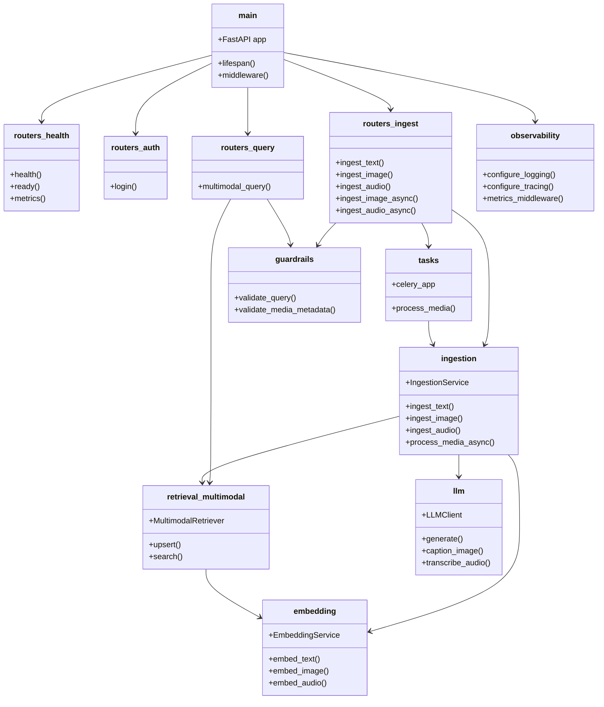

# C4 — Code Diagram: Multi-Modal RAG Backend

This diagram illustrates the key code-level relationships in the FastAPI backend.

## Key Modules

| File | Responsibility |
|------|----------------|
| `app/main.py` | FastAPI application assembly and middleware. |
| `app/routers/health.py` | Health, readiness, and Prometheus metrics endpoints. |
| `app/routers/auth.py` | OAuth2 password login and JWT issuance. |
| `app/routers/ingest.py` | Text, image, and audio ingestion endpoints. |
| `app/routers/query.py` | Multimodal query endpoint. |
| `app/ingestion.py` | Ingestion service for all modalities. |
| `app/retrieval/multimodal.py` | Qdrant-based multimodal retriever. |
| `app/embedding.py` | Embedding service with mock and Ollama paths. |
| `app/llm.py` | LLM client for generation, captioning, transcription. |
| `app/tasks.py` | Celery app and async media processing task. |
| `app/guardrails.py` | Text and media safety checks. |
| `app/observability.py` | Logging, tracing, and metrics. |
