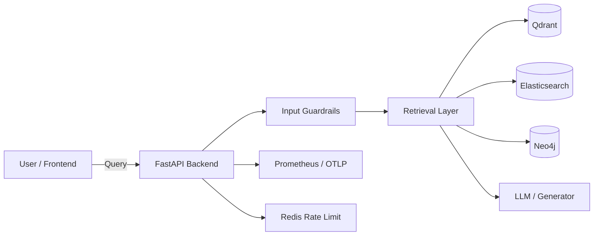

<p align="center">
  <h1 align="center">🏭 RAG Foundry</h1>
  <p align="center">
    Production-ready templates for 5 advanced Retrieval-Augmented Generation (RAG) architectures.
  </p>
  <p align="center">
    <a href="https://github.com/AmosBunde/rag-foundry/actions/workflows/ci.yml">
      
    </a>
    <a href="LICENSE">
      
    </a>
    
    
  </p>
</p>

---

## 📖 Table of Contents

- [What is RAG Foundry?](#what-is-rag-foundry)
- [Architectures](#-architectures)
- [System Overview](#-system-overview)
- [Quick Start](#-quick-start)
- [Development Workflow](#-development-workflow)
- [Testing](#-testing)
- [Comparison Matrix](#-comparison-matrix)
- [Cost & Scaling Strategy](#-cost--scaling-strategy)
- [Deployment](#-deployment)
- [Security & Guardrails](#-security--guardrails)
- [Observability](#-observability)
- [Project Structure](#-project-structure)
- [Architecture Decision Records](#-architecture-decision-records)
- [Contributing](#-contributing)
- [License](#-license)

---

## What is RAG Foundry?

**RAG Foundry** is a collection of reference implementations for modern RAG patterns. Each architecture is a self-contained, full-stack application with:

- **FastAPI** backend with clean separation of concerns
- **Next.js 14** frontend with React Server Components and shadcn/ui
- **Dense & sparse retrieval** using Qdrant, Elasticsearch, Neo4j, and custom strategies
- **Guardrails** for PII, prompt injection, toxicity, and domain-specific safety
- **Auth & rate limiting** via JWT and Redis
- **Observability** with OpenTelemetry traces and Prometheus metrics
- **Infrastructure-as-code** with Terraform for AWS, Azure, GCP, and bare-metal/VPS
- **Comprehensive tests** with ≥80% backend coverage

Every pattern is designed to be copied, extended, and deployed to production.

---

## 🏗️ Architectures

| # | Architecture | Use Case | Core Pattern | Key Tech |
|---|-------------|----------|--------------|----------|
| 01 | [Hybrid RAG](01-hybrid-rag/) | Best of both retrieval worlds | Dense + sparse fusion with Reciprocal Rank Fusion (RRF) | FastAPI, Qdrant, Elasticsearch |
| 02 | [Graph RAG](02-graph-rag/) | Structured knowledge QA | Entity/relation extraction + graph traversal | FastAPI, Neo4j, NetworkX |
| 03 | [Agentic RAG (Hospital)](03-agentic-rag-hospital/) | Multi-step medical QA | LangGraph multi-agent pipeline with planner/retriever/verifier/responder | FastAPI, LangGraph, FHIR R4 |
| 04 | [Corrective RAG](04-corrective-rag/) | High-precision retrieval | Confidence scoring, feedback loop, and re-ranking | FastAPI, custom evaluators |
| 05 | [Multi-Modal RAG](05-multimodal-rag/) | Media-rich QA | Text + image + audio ingestion and retrieval | FastAPI, Celery, Qdrant |

---

## 🏭 System Overview



All architectures share a common local stack orchestrated by `docker-compose.yml`:

| Service | Purpose |
|---------|---------|
| Postgres | Relational metadata and user data |
| Redis | Rate limiting, caching, sessions |
| Qdrant | Dense vector store |
| Elasticsearch | Full-text / sparse retrieval |
| Neo4j | Knowledge graph store |
| Ollama | Local LLM / embedding inference (optional) |

---

## 🚀 Quick Start

### Prerequisites

- Docker & Docker Compose
- Python 3.12
- Node.js 20+
- (Optional) Ollama for local models

### 1. Start shared services

```bash
make up
```

This starts Postgres, Redis, Qdrant, Elasticsearch, Neo4j, and Ollama in the background.

### 2. Run backend tests for one architecture

```bash
cd 01-hybrid-rag/backend
python3 -m venv .venv
source .venv/bin/activate
pip install -r requirements.txt -r requirements-dev.txt
pytest
```

### 3. Run the frontend

```bash
cd 01-hybrid-rag/frontend
npm install
npm run dev
```

Open [http://localhost:3000](http://localhost:3000).

---

## 🛠️ Development Workflow

```bash
# Start shared infrastructure
make up

# Run all backend + frontend unit tests
make test

# Run tests for a single architecture
make test ARCH=03-agentic-rag-hospital

# Lint all code
make lint

# Format all code
make fmt

# Stop everything
make down
```

---

## 🧪 Testing

Each architecture enforces a **minimum 80% backend code coverage** gate.

Verified results from `make test ARCH=all`:

| Architecture | Backend Tests | Coverage | Frontend Unit Tests | Build |
|--------------|---------------|----------|---------------------|-------|
| 01 Hybrid RAG | 20 passed | 87%+ | ✅ | ✅ |
| 02 Graph RAG | 35 passed | 84.4% | ✅ | ✅ |
| 03 Agentic RAG Hospital | 34 passed | 90.0% | ✅ | ✅ |
| 04 Corrective RAG | 39 passed | 89.4% | ✅ | ✅ |
| 05 Multi-Modal RAG | 35 passed | 86.5% | ✅ | ✅ |

End-to-end Playwright tests are available via `npm run test:e2e` in each frontend directory and require a running dev server.

---

## 📊 Comparison Matrix

| Dimension | Hybrid RAG | Graph RAG | Agentic RAG | Corrective RAG | Multi-Modal RAG |
|-----------|------------|-----------|-------------|----------------|-----------------|
| **Latency** | Low | Medium | Medium-High | Medium | Medium-High |
| **Cost** | Low | Medium | Medium | Low | Medium |
| **Complexity** | Medium | High | High | Medium | High |
| **Best For** | General QA | Structured knowledge | Medical / agent workflows | High-precision QA | Media-rich QA |
| **Retrieval** | Dense + sparse RRF | Graph + vector | Dense + sparse RRF | Dense + sparse + evaluator | Dense multi-modal |

---

## 💰 Cost & Scaling Strategy

| Architecture | Scaling Vector | Cost Driver | Scaling Strategy |
|--------------|----------------|-------------|------------------|
| **Hybrid RAG** | Horizontal API + vector DB | Elasticsearch + Qdrant replicas | Scale API containers; add Qdrant/ES replicas; cache frequent queries in Redis. |
| **Graph RAG** | Graph store + vector DB | Neo4j memory + query complexity | Scale read replicas; pre-compute graph snapshots; offload heavy traversals. |
| **Agentic RAG** | LLM calls + agent iterations | LangGraph / LLM token usage | Limit agent loop iterations; use cheaper models for planner/verifier; add request quotas. |
| **Corrective RAG** | Retrieval + evaluator loops | Extra LLM grading calls | Cache retrieval scores; short-circuit on high confidence; batch feedback writes. |
| **Multi-Modal RAG** | Media workers + vector DB | Transcription/embedding workers + storage | Scale Celery workers; store media in object storage; compress embeddings. |

---

## 🌍 Deployment

Each architecture ships with Terraform modules under `infra/`:

- `infra/bare-metal/` — VPS / self-hosted deployment with Docker Compose and systemd
- `infra/aws/` — ECS + RDS + Elasticache + VPC
- `infra/azure/` — Container Apps + Cosmos DB / Postgres + Azure Cache
- `infra/gcp/` — Cloud Run + Cloud SQL + Memorystore

Deploy manually:

```bash
cd 01-hybrid-rag/infra/aws
terraform init
terraform plan -var="environment=staging"
terraform apply -var="environment=staging"
```

Or use the GitHub Actions workflows:

- `.github/workflows/deploy-aws.yml`
- `.github/workflows/deploy-azure.yml`
- `.github/workflows/deploy-gcp.yml`

These are `workflow_dispatch` triggered and require cloud credentials stored as GitHub secrets.

---

## 🔒 Security & Guardrails

Every backend implements:

- **JWT authentication** with access/refresh tokens
- **Redis-backed rate limiting** per endpoint
- **Input guardrails** via Presidio and custom rules:
  - PII detection and redaction
  - Prompt injection detection
  - Toxicity / content safety
  - Domain-specific rules (medical safety, media safety)
- **CORS, CSP, and secure headers** in frontend configs
- **Structured JSON logging** for auditability

Guardrail policies live in each architecture's `guardrails/` directory.

---

## 📈 Observability

Each service exposes:

- **Health, readiness, and metrics** endpoints (`/health`, `/ready`, `/metrics`)
- **OpenTelemetry** traces and logs
- **Prometheus** metrics via `prometheus-client`
- **Structured logging** with `structlog`

---

## 📁 Project Structure

```
.
├── 01-hybrid-rag/              # Dense + sparse RRF RAG
├── 02-graph-rag/               # Knowledge graph RAG
├── 03-agentic-rag-hospital/    # Multi-agent medical RAG
├── 04-corrective-rag/          # Self-correcting RAG
├── 05-multimodal-rag/          # Text + image + audio RAG
├── docs/
│   ├── adr/                    # Cross-cutting ADRs
│   └── c4/                     # System landscape C4 diagram
├── .github/
│   ├── workflows/              # CI + deployment workflows
│   ├── ISSUE_TEMPLATE/         # Issue templates
│   └── PULL_REQUEST_TEMPLATE.md
├── scripts/
│   ├── bootstrap-app.sh        # Scaffold a new architecture
│   ├── run-tests.sh            # Run backend + frontend tests
│   └── setup-local.sh          # Local dev environment setup
├── docker-compose.yml          # Shared local services
├── Makefile                    # Common commands
├── CHANGELOG.md
├── LICENSE
└── README.md
```

Each architecture follows the same internal layout:

```
01-hybrid-rag/
├── README.md
├── adr/                        # Architecture Decision Records
├── backend/
│   ├── app/
│   │   ├── routers/            # FastAPI route modules
│   │   ├── retrieval/          # Retrieval implementations
│   │   └── ...                 # Auth, config, guardrails, LLM, etc.
│   ├── tests/                  # pytest suite
│   ├── Dockerfile
│   └── requirements.txt
├── frontend/                   # Next.js 14 + shadcn/ui
├── guardrails/                 # Guardrail policy YAMLs
├── infra/                      # Terraform modules
│   ├── bare-metal/
│   ├── aws/
│   ├── azure/
│   └── gcp/
├── c4/                         # C1-C4 diagrams
└── tests/                      # Integration tests
```

---

## 📝 Architecture Decision Records

Cross-cutting decisions are documented in `docs/adr/`:

- [ADR-000: Monorepo Structure](docs/adr/ADR-000-monorepo-structure.md)
- [ADR-001: Shared CI/CD](docs/adr/ADR-001-shared-ci-cd.md)
- [ADR-002: Security Baseline](docs/adr/ADR-002-security-baseline.md)

Each architecture has its own ADRs under `<architecture>/adr/`.

---

## 🤝 Contributing

1. Fork the repository.
2. Create a feature branch: `git checkout -b feature/<architecture>-<change>`.
3. Make your changes with tests.
4. Run `make test ARCH=<architecture>` to verify.
5. Open a PR against `main`.
6. Squash and merge after review.

Please read the issue and PR templates before contributing.

---

## 📜 License

MIT — see [LICENSE](LICENSE).
