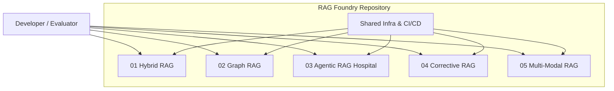

# C4 System Landscape

## RAG Foundry Ecosystem

## Purpose
This landscape shows the five RAG architecture templates coexisting in a single repository, each independent but sharing common tooling and deployment patterns.
