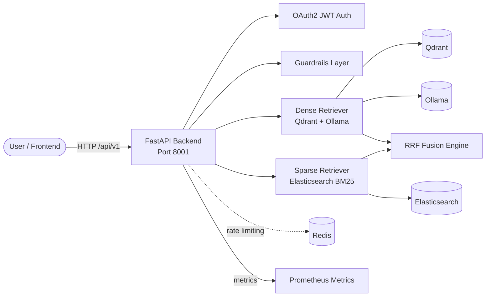

# 01-hybrid-rag

A production-template implementation of **Hybrid RAG** that combines dense vector retrieval (Qdrant + Ollama embeddings) with sparse lexical retrieval (Elasticsearch BM25) and merges both result sets using **Reciprocal Rank Fusion (RRF)**. The backend is built with **FastAPI**; the `frontend/` directory is a **Next.js** scaffold ready for UI development.

This architecture is part of the RAG Foundry monorepo and shares the root `docker-compose.yml`, `Makefile`, and `scripts/` tooling.

---

## Overview

Hybrid RAG addresses the limitations of single-retrieval approaches:

- **Dense retrieval** captures semantic meaning and paraphrases well.
- **Sparse retrieval** excels at exact keyword matching, rare terms, and acronym matching.
- **Reciprocal Rank Fusion** combines the two ranked lists without requiring score calibration between different retrieval systems.

The template ships with:

| Layer | Technology | Purpose |
|-------|------------|---------|
| API Framework | FastAPI 0.110 | REST API, dependency injection, auto-generated OpenAPI docs |
| Dense Store | Qdrant 1.9 | Vector search with cosine similarity, 768-dim embeddings |
| Sparse Store | Elasticsearch 8.13 | BM25 lexical search |
| Embeddings / LLM | Ollama | Local `nomic-embed-text` embeddings and `llama3:8b` generation |
| Auth | JWT (python-jose) | Bearer-token auth with a demo user (replace in production) |
| Guardrails | Regex + optional Presidio | Input length, prompt injection, PII, toxicity checks |
| Observability | Prometheus + OpenTelemetry + structlog | Metrics, distributed traces, structured JSON logs |
| Rate Limiting | slowapi | Per-IP rate limits (Redis-backed in production) |
| Infra (scaffold) | Terraform | Modules for bare-metal/VPS, AWS, Azure, and GCP |

---

## Architecture Diagram



### Request Flow

1. Client authenticates via `/api/v1/auth/token` and receives a JWT.
2. Query is validated by guardrails (length, prompt injection, PII, toxicity).
3. If `use_dense=true`, the query is embedded via Ollama and Qdrant returns top-K semantic chunks.
4. If `use_sparse=true`, Elasticsearch returns top-K BM25 chunks.
5. When both result sets exist, RRF (`k=60`) fuses them into a single ranked list.
6. Results are returned with per-request latency and source provenance (`dense`, `sparse`, or `fusion`).

---

## Quick Start (Local)

### Prerequisites

- Docker + Docker Compose
- Python 3.11+ (for local development)
- Node.js 20+ (for frontend work)
- Ollama (or use the Ollama container in `docker-compose.yml`)
- `make` (optional, for shared scripts)

The [`scripts/setup-local.sh`](../scripts/setup-local.sh) helper can install the prerequisites on Debian/Ubuntu or macOS.

### 1. Start shared infrastructure

From the repository root (`rag-architectures/`):

```bash
docker compose up -d
```

This starts PostgreSQL, Redis, Qdrant, Elasticsearch, Neo4j, and Ollama.

### 2. Pull the embedding model

```bash
ollama pull nomic-embed-text
ollama pull llama3:8b
```

If you are using the Dockerised Ollama service, run:

```bash
docker exec -it rag-ollama ollama pull nomic-embed-text
docker exec -it rag-ollama ollama pull llama3:8b
```

### 3. Run the backend locally

```bash
cd backend
python -m venv .venv
source .venv/bin/activate
pip install -r requirements.txt
uvicorn app.main:app --reload --host 0.0.0.0 --port 8001
```

### 4. Verify the service

```bash
curl http://localhost:8001/health
curl http://localhost:8001/ready
```

### 5. Ingest and query

Authenticate:

```bash
TOKEN=$(curl -s -X POST http://localhost:8001/api/v1/auth/token \
  -H "Content-Type: application/x-www-form-urlencoded" \
  -d "username=demo&password=demo" | jq -r '.access_token')
```

Ingest a document:

```bash
curl -X POST http://localhost:8001/api/v1/ingest \
  -H "Authorization: Bearer $TOKEN" \
  -H "Content-Type: application/json" \
  -d '{
    "documents": [
      {
        "id": "doc-001",
        "text": "Hybrid RAG combines dense vector search with sparse lexical search to improve recall.",
        "metadata": {"source": "readme"}
      }
    ]
  }'
```

Run a hybrid query:

```bash
curl -X POST http://localhost:8001/api/v1/query/hybrid \
  -H "Authorization: Bearer $TOKEN" \
  -H "Content-Type: application/json" \
  -d '{"query": "What is hybrid retrieval?", "top_k": 5}'
```

### 6. Run via Docker Compose (all services)

```bash
docker compose --profile apps up -d
```

This also builds and starts the `01-hybrid-rag-backend` container on port `8001`.

### 7. Start the frontend (scaffold)

```bash
cd frontend
# After scaffolding a Next.js app, e.g.:
npm install
npm run dev
```

The `frontend/` directory currently contains an empty Next.js scaffold (`src/`, `public/`, `e2e/`, `tests/`). Implement pages that call `/api/v1/query/hybrid` and `/api/v1/ingest`.

---

## Deployment Guides

The `infra/` directory contains Terraform module scaffolds for each target platform. The following guides describe the intended resources and deployment steps. Each module is a starting point; extend it with your VPC/VNet/networking, TLS certificates, DNS, and secrets management.

### Bare Metal / VPS

Best for: self-hosted labs, single-tenant deployments, or air-gapped environments.

Provisioned resources:

- Docker Engine on the target host.
- `docker-compose.yml` (or a production variant) deployed via Terraform `remote-exec` or Ansible.
- systemd service unit for the backend container.
- Optional: Caddy or Traefik reverse proxy for TLS termination.

Deploy:

```bash
cd infra/bare-metal
terraform init
terraform apply -var="host=203.0.113.10" -var="ssh_user=ubuntu"
```

After apply:

```bash
ssh ubuntu@203.0.113.10
cd /opt/hybrid-rag
docker compose up -d
```

### AWS

Best for: scalable, managed production deployments.

Provisioned resources (intended module):

- VPC, public/private subnets, NAT gateway.
- ECS Fargate service for the FastAPI backend.
- Amazon OpenSearch Service for sparse retrieval (or self-managed Elasticsearch on EC2).
- Amazon Qdrant on EC2 or a managed vector store such as Amazon OpenSearch Serverless with vector engine.
- ElastiCache (Redis) for rate limiting.
- Secrets Manager for JWT secret and service credentials.
- Application Load Balancer with TLS.

Deploy:

```bash
cd infra/aws
terraform init
terraform apply -var="region=us-east-1" -var="environment=production"
```

Push the Docker image to ECR:

```bash
aws ecr get-login-password --region us-east-1 | docker login --username AWS --password-stdin <account>.dkr.ecr.us-east-1.amazonaws.com
docker build -t hybrid-rag-backend ../../backend
docker tag hybrid-rag-backend:latest <account>.dkr.ecr.us-east-1.amazonaws.com/hybrid-rag-backend:latest
docker push <account>.dkr.ecr.us-east-1.amazonaws.com/hybrid-rag-backend:latest
```

### Azure

Best for: Microsoft-centric organisations or Azure OpenAI integration.

Provisioned resources (intended module):

- Resource group and VNet.
- Azure Container Apps or AKS for the backend.
- Azure Cognitive Search for sparse lexical retrieval.
- Azure Cache for Redis.
- Azure Container Registry for images.
- Azure Key Vault for secrets.
- Application Gateway or Front Door for TLS/load balancing.

Deploy:

```bash
cd infra/azure
terraform init
terraform apply -var="location=westeurope" -var="environment=production"
```

### GCP

Best for: Kubernetes-native teams or BigQuery-integrated pipelines.

Provisioned resources (intended module):

- VPC and subnets.
- Cloud Run or GKE for the backend.
- Vertex AI Vector Search or self-managed Qdrant on Compute Engine.
- Elasticsearch on Compute Engine or Elastic Cloud on GCP.
- Memorystore (Redis) for rate limiting.
- Secret Manager for credentials.
- Cloud Load Balancing for HTTPS.

Deploy:

```bash
cd infra/gcp
terraform init
terraform apply -var="project_id=my-gcp-project" -var="region=us-central1"
```

---

## Testing

Backend tests use **pytest** with **pytest-asyncio**, **httpx**, **respx**, and **fakeredis**. The coverage gate is configured at **80%** in `pyproject.toml`.

### Run backend tests

```bash
cd backend
python -m pytest
```

### Run tests from the repo root

```bash
# All architectures
make test

# Only this architecture
make test ARCH=01-hybrid-rag
```

### Test categories

| File | Coverage |
|------|----------|
| `tests/test_auth.py` | JWT token issuance and validation |
| `tests/test_guardrails.py` | Prompt injection, PII, toxicity, length checks |
| `tests/test_health.py` | `/health`, `/ready`, `/metrics` |
| `tests/test_ingestion.py` | Document chunking and dual indexing |
| `tests/test_llm.py` | Ollama generate client |
| `tests/test_query.py` | Hybrid, dense, sparse query endpoints + guardrail blocking |
| `tests/test_retrieval.py` | Qdrant and Elasticsearch retriever unit tests |

### Lint and format

```bash
cd backend
ruff check .
ruff format .
mypy .
```

### Frontend tests

Once the Next.js scaffold is implemented:

```bash
cd frontend
npm install
npm run test:ci
npm run lint
```

---

## Guardrails

The guardrails are layered in `backend/app/guardrails.py` and configured via YAML files in `guardrails/`.

### Implemented checks

1. **Input length** — rejects queries or documents exceeding configurable limits.
2. **Prompt injection** — regex heuristics for common instruction-override patterns.
3. **PII detection** — regex for SSN, credit card, email, phone; optional Presidio entities.
4. **Toxicity / content safety** — heuristic keyword lists; cloud API placeholders in `content-safety.yaml`.

### Configuration files

| File | Purpose |
|------|---------|
| `guardrails/input-schemas.json` | JSON Schema snippets for request validation |
| `guardrails/prompt-injection.yaml` | Heuristic patterns and optional LLM-based classifier |
| `guardrails/pii-rules.yaml` | Regex and Presidio entity rules |
| `guardrails/content-safety.yaml` | Content categories and severity thresholds |
| `guardrails/rate-limit-config.yaml` | Per-endpoint rate limits |

### Enabling Presidio PII checks

Set the `USE_PRESIDIO=true` environment variable and ensure `presidio-analyzer` is installed (already in `requirements.txt`).

```bash
USE_PRESIDIO=true uvicorn app.main:app --reload
```

### Rate limiting

`slowapi` is wired into the FastAPI app. In production, configure a Redis-backed storage backend for slowapi and align it with `guardrails/rate-limit-config.yaml`.

---

## API Documentation (OpenAPI/Swagger)

FastAPI auto-generates interactive API documentation:

- **Swagger UI**: [http://localhost:8001/docs](http://localhost:8001/docs)
- **ReDoc**: [http://localhost:8001/redoc](http://localhost:8001/redoc)
- **OpenAPI JSON**: [http://localhost:8001/openapi.json](http://localhost:8001/openapi.json)

### Key endpoints

| Method | Path | Description | Auth |
|--------|------|-------------|------|
| GET | `/health` | Liveness probe | No |
| GET | `/ready` | Readiness probe with dependency checks | No |
| GET | `/metrics` | Prometheus metrics | No |
| POST | `/api/v1/auth/token` | OAuth2 password login | No |
| POST | `/api/v1/ingest` | Ingest documents into both indexes | Bearer JWT |
| POST | `/api/v1/query/hybrid` | Dense + sparse + RRF | Bearer JWT |
| POST | `/api/v1/query/dense` | Dense-only search | Bearer JWT |
| POST | `/api/v1/query/sparse` | Sparse-only search | Bearer JWT |

### Example request bodies

**Ingest:**

```json
{
  "documents": [
    {
      "id": "doc-001",
      "text": "Hybrid RAG merges dense and sparse retrieval.",
      "metadata": {"source": "docs"}
    }
  ]
}
```

**Hybrid query:**

```json
{
  "query": "What is hybrid retrieval?",
  "top_k": 5,
  "use_dense": true,
  "use_sparse": true
}
```

---

## Troubleshooting

### Backend fails to start with `ModuleNotFoundError`

Ensure you are inside the `backend/` directory and the virtual environment is activated:

```bash
cd backend
source .venv/bin/activate
pip install -r requirements.txt
```

### `Connection refused` to Qdrant or Elasticsearch

The services must be running. From the repo root:

```bash
docker compose ps
docker compose logs qdrant elasticsearch
```

If running the backend locally (not in Docker), verify `QDRANT_URL` and `ELASTICSEARCH_URL` point to `localhost`:

```bash
export QDRANT_URL=http://localhost:6333
export ELASTICSEARCH_URL=http://localhost:9200
```

If running the backend inside Docker while dependencies are on the host, use host networking or set the URLs to the Docker host IP.

### Ollama embeddings time out

First embedding request can be slow while the model loads. Increase the timeout or pre-load the model:

```bash
ollama run nomic-embed-text
```

If using the Dockerised Ollama, ensure the backend container can reach `http://ollama:11434` (set via `docker-compose.yml`).

### Elasticsearch returns 401/403

The local `docker-compose.yml` disables Elasticsearch security (`xpack.security.enabled=false`). In production, configure authentication and update `ELASTICSEARCH_URL` with credentials.

### Rate limiting during load tests

slowapi uses in-memory storage by default. For multi-replica deployments, switch to a Redis storage backend for slowapi.

### Low recall from hybrid search

- Ensure both dense and sparse indexes contain the same chunked documents.
- Tune `top_k` sent to each retriever before fusion (currently each retriever receives the same `top_k`).
- Adjust the RRF constant `k` in `app/retrieval/fusion.py` (default `60`). Lower values emphasise top-ranked documents.

### Presidio model not found

Presidio requires the `en_core_web_sm` spaCy model. It is installed automatically via `requirements.txt`. If missing:

```bash
python -m spacy download en_core_web_sm
```

### Tests fail with coverage below 80%

Add or update tests, then run:

```bash
cd backend
python -m pytest --cov=app --cov-report=term-missing
```

---

## Related Documentation

- [Architecture Decision Records](./adr/)
- [C4 Diagrams](./c4/)
- [System Landscape C4](../docs/c4/system-landscape.md)
