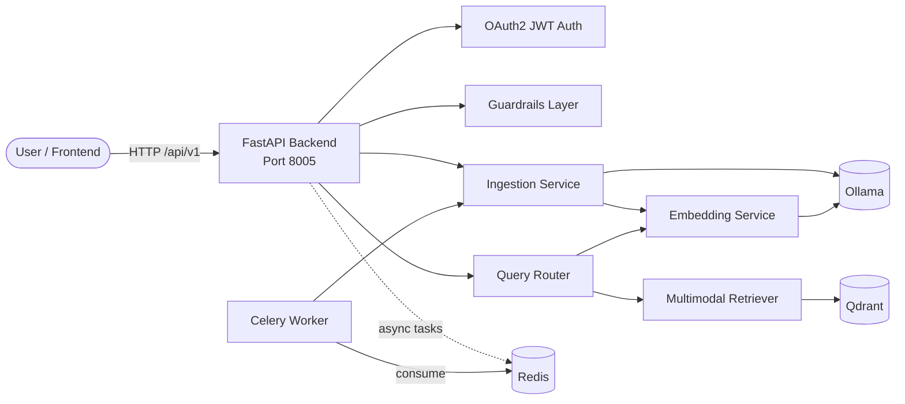

# 05-multimodal-rag

A production-template implementation of **Multi-Modal RAG** that retrieves across **text**, **images**, and **audio** from a single Qdrant vector store. The backend is built with **FastAPI**; the frontend is a **Next.js 14** application with multimodal upload and a result gallery.

This architecture is part of the [RAG Foundry](../README.md) monorepo and shares the root `docker-compose.yml`, `Makefile`, and `scripts/` tooling.

---

## Overview

Multi-Modal RAG extends traditional RAG by allowing queries to retrieve content from multiple modalities:

- **Text**: chunked documents embedded via Ollama (`nomic-embed-text`) with mock fallback.
- **Images**: uploaded images receive a caption and a CLIP-style mock embedding.
- **Audio**: uploaded audio is transcribed (mock/Ollama) and embedded as audio + text chunks.

All embeddings live in a shared 512-dimensional Qdrant collection. The query endpoint embeds the query text and returns mixed-modal results, optionally filtered by modality.

| Layer | Technology | Purpose |
|-------|------------|---------|
| API Framework | FastAPI 0.110 | REST API, dependency injection, auto-generated OpenAPI docs |
| Vector Store | Qdrant 1.9 | Unified dense retrieval for text/image/audio |
| Embeddings / LLM | Ollama | Text embeddings, image captions, audio transcription |
| Auth | JWT (python-jose) | Bearer-token auth with a demo user |
| Guardrails | Regex + optional Presidio + media checks | Input length, prompt injection, PII, toxicity, file safety |
| Observability | Prometheus + OpenTelemetry + structlog | Metrics, distributed traces, structured JSON logs |
| Rate Limiting | slowapi | Per-IP rate limits (Redis-backed in production) |
| Async Processing | Celery + Redis | Heavy image/audio processing offloaded to workers |
| Infra (scaffold) | Terraform | Modules for bare-metal/VPS, AWS, Azure, and GCP |

---

## Architecture Diagram



### Request Flow

1. Client authenticates via `/api/v1/auth/token` and receives a JWT.
2. Text/image/audio content is validated by guardrails.
3. Text documents are chunked and embedded.
4. Images are captioned and embedded with mock CLIP vectors.
5. Audio is transcribed and embedded as audio + text chunks.
6. All items are upserted into Qdrant with a `modality` payload.
7. A query embeds the text and searches Qdrant, optionally filtered by modality.
8. Results are returned in a mixed-modal gallery.

---

## Quick Start (Local)

### Prerequisites

- Docker + Docker Compose
- Python 3.12+ (for local development)
- Node.js 20+ (for frontend work)
- Ollama (optional; mock embeddings work without it)

### 1. Start shared infrastructure

From the repository root (`rag-architectures/`):

```bash
docker compose up -d
```

This starts PostgreSQL, Redis, Qdrant, Elasticsearch, Neo4j, and Ollama.

### 2. Run the backend locally

```bash
cd 05-multimodal-rag/backend
python -m venv /tmp/mmrag-venv
source /tmp/mmrag-venv/bin/activate
pip install -r requirements.txt
uvicorn app.main:app --reload --host 0.0.0.0 --port 8005
```

Set `MOCK_EMBEDDINGS=true` if Ollama is not running.

### 3. Verify the service

```bash
curl http://localhost:8005/health
curl http://localhost:8005/ready
```

### 4. Ingest and query

Authenticate:

```bash
TOKEN=$(curl -s -X POST http://localhost:8005/api/v1/auth/token \
  -H "Content-Type: application/x-www-form-urlencoded" \
  -d "username=demo&password=demo" | jq -r '.access_token')
```

Ingest text:

```bash
curl -X POST http://localhost:8005/api/v1/ingest/text \
  -H "Authorization: Bearer $TOKEN" \
  -H "Content-Type: application/json" \
  -d '{
    "documents": [
      {"id": "doc-001", "text": "Multi-modal RAG supports text, images, and audio.", "metadata": {"source": "readme"}}
    ]
  }'
```

Query across all modalities:

```bash
curl -X POST http://localhost:8005/api/v1/query/multimodal \
  -H "Authorization: Bearer $TOKEN" \
  -H "Content-Type: application/json" \
  -d '{"query": "multi-modal retrieval", "top_k": 5}'
```

### 5. Start the frontend

```bash
cd 05-multimodal-rag/frontend
npm install
npm run dev
```

The frontend is available at [http://localhost:3005](http://localhost:3005).

---

## Deployment Guides

The `infra/` directory contains Terraform module scaffolds for each target platform. See the README in each module for details.

- **Bare Metal / VPS**: `infra/bare-metal/`
- **AWS**: `infra/aws/`
- **Azure**: `infra/azure/`
- **GCP**: `infra/gcp/`

Do not apply these modules without reviewing placeholders (notably `qdrant_url` and credentials).

---

## Testing

### Backend

```bash
cd 05-multimodal-rag/backend
python -m pytest
```

The coverage gate is configured at **80%** in `pyproject.toml`.

### Frontend

```bash
cd 05-multimodal-rag/frontend
npm install
npm run test:ci
npm run lint
```

### Integration tests

```bash
cd 05-multimodal-rag
python -m pytest tests/
```

---

## Guardrails

The guardrails are layered in `backend/app/guardrails.py` and configured via YAML files in `guardrails/`.

| File | Purpose |
|------|---------|
| `guardrails/input-schemas.json` | JSON Schema snippets for request validation |
| `guardrails/prompt-injection.yaml` | Heuristic patterns and optional LLM classifier |
| `guardrails/pii-rules.yaml` | Regex and Presidio entity rules |
| `guardrails/content-safety.yaml` | Content categories and severity thresholds |
| `guardrails/media-safety.yaml` | Media upload limits, MIME allowlists, filename checks |
| `guardrails/rate-limit-config.yaml` | Per-endpoint rate limits |

---

## API Documentation

FastAPI auto-generates interactive API documentation:

- **Swagger UI**: [http://localhost:8005/docs](http://localhost:8005/docs)
- **ReDoc**: [http://localhost:8005/redoc](http://localhost:8005/redoc)

### Key endpoints

| Method | Path | Description | Auth |
|--------|------|-------------|------|
| GET | `/health` | Liveness probe | No |
| GET | `/ready` | Readiness probe | No |
| GET | `/metrics` | Prometheus metrics | No |
| POST | `/api/v1/auth/token` | OAuth2 password login | No |
| POST | `/api/v1/ingest/text` | Ingest text documents | Bearer JWT |
| POST | `/api/v1/ingest/image` | Upload and index image | Bearer JWT |
| POST | `/api/v1/ingest/audio` | Upload and index audio | Bearer JWT |
| POST | `/api/v1/ingest/image/async` | Queue image for async processing | Bearer JWT |
| POST | `/api/v1/ingest/audio/async` | Queue audio for async processing | Bearer JWT |
| POST | `/api/v1/query/multimodal` | Mixed-modal retrieval | Bearer JWT |

---

## Related Documentation

- [Architecture Decision Records](./adr/)
- [C4 Diagrams](./c4/)
- [Root RAG Foundry README](../README.md)
